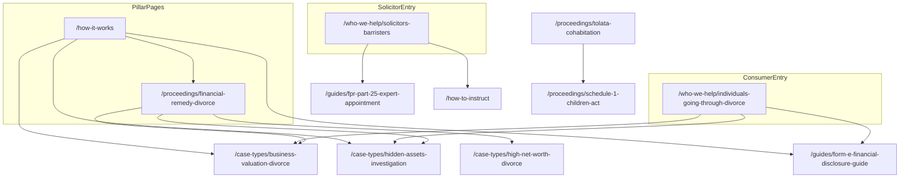

# SEO Architecture: familycourtaccountant.com

**Version:** 1.0  
**Last updated:** June 2026  
**Canonical site:** [https://www.familycourtaccountant.com](https://www.familycourtaccountant.com) (apex redirects to `www` via `middleware.ts`)

---

## Document purpose

This is the single source of truth for SEO on FamilyCourtAccountant.com: keyword targeting, content clusters, internal linking, structured data, generative-engine optimization (GEO), off-page targets, competitor monitoring, dual-audience strategy, and deployment. Content, development, and outreach should align to this document.

| Audience | Primary goal |
|----------|----------------|
| Family law solicitors and barristers | FPR Part 25 expert witnesses for financial remedy, Schedule 1, TOLATA, and nuptial agreement proceedings |
| Individuals going through divorce or separation | Independent forensic accountant help for hidden assets, business valuation, Form E review, and lifestyle analysis |

**Primary ranking goal:** family court accountant (UK and non-geo variants) and closely related transactional queries (forensic accountant divorce UK, hidden assets divorce UK, business valuation divorce UK expert).

**Network differentiator:** This is the only site in the expert-witness network with a significant direct-to-consumer organic audience alongside the professional solicitor audience. Tone, internal linking, and landing-page strategy must serve both.

**Implementation reference:** Routes and data live under `app/`, `lib/data/`, `lib/schema/`, and `lib/seo/publicUrlInventory.ts`. Regenerate sitemap with `npm run seo:generate`.

---

## Table of contents

1. [URL canonicalization](#url-canonicalization)
2. [Keyword strategy](#1-keyword-strategy)
3. [Content cluster map](#2-content-cluster-map)
4. [Internal linking rules](#3-internal-linking-rules)
5. [Schema architecture](#4-schema-architecture)
6. [GEO optimization targets](#5-geo-optimization-targets)
7. [Off-page SEO targets](#6-off-page-seo-targets)
8. [Competitor monitoring](#7-competitor-monitoring)
9. [Strategic note: dual audience](#8-strategic-note-dual-audience)
10. [Deployment checklist](#9-deployment-checklist)
- [Appendix A: Full route inventory](#appendix-a-full-route-inventory)
- [Appendix B: Case-type and guide slugs](#appendix-b-case-type-and-guide-slugs)
- [Appendix C: Glossary fragment IDs](#appendix-c-glossary-fragment-ids)
- [Appendix D: Title and meta templates](#appendix-d-title-and-meta-templates)
- [Appendix E: Implementation status](#appendix-e-implementation-status)

---

## URL canonicalization

Canonical URLs use **build-spec slugs** (keyword-rich, match H1s and `lib/data/*`). Where the original SEO brief used shorter paths, use the canonical URL below.

| SEO brief (alias) | Canonical URL |
|-------------------|---------------|
| `/who-we-help/solicitors` | `/who-we-help/solicitors-barristers` |
| `/who-we-help/individuals` | `/who-we-help/individuals-going-through-divorce` |
| `/guides/business-valuation-divorce` | `/guides/business-valuation-divorce-guide` |
| `/guides/form-e-financial-disclosure` | `/guides/form-e-financial-disclosure-guide` |
| `/guides/schedule-1-financial-guide` | `/guides/schedule-1-children-act-financial-guide` |
| `/guides/tolata-cohabitation-guide` | `/guides/tolata-cohabitation-financial-guide` |
| `/case-types/business-valuation` | `/case-types/business-valuation-divorce` |
| `/case-types/hidden-assets` | `/case-types/hidden-assets-investigation` |
| `/case-types/lifestyle-analysis` | `/case-types/lifestyle-analysis-income` |
| `/case-types/add-backs` | `/case-types/add-backs-financial-reconstruction` |
| `/proceedings/tolata` | `/proceedings/tolata-cohabitation` |

Do not publish duplicate content at alias paths. If aliases are ever needed, use 301 redirects to canonical URLs.

---

## 1. Keyword strategy

### Tier 1 — Transactional

- family court accountant UK
- family court accountant
- forensic accountant divorce UK
- forensic accountant financial remedy UK
- family law forensic accountant UK
- divorce forensic accountant UK
- forensic accountant hidden assets UK
- business valuation divorce UK expert
- family court expert accountant
- matrimonial forensic accountant UK

**Primary landing pattern:** homepage, `/services`, `/contact`, relevant `/proceedings/*` and `/case-types/*`.

**Audience split:** Solicitor-intent queries route to `/who-we-help/solicitors-barristers`, `/qualifications`, `/how-to-instruct`. Consumer-intent variants of divorce/hidden-assets queries also route to `/who-we-help/individuals-going-through-divorce`.

### Tier 2 — Informational

- what does a family court accountant do UK
- how is a business valued in divorce UK
- what are add-backs in divorce UK
- how to find hidden assets divorce UK
- what is Form E financial remedy
- FPR Part 25 forensic accountant
- single joint expert divorce accountant
- lifestyle analysis divorce UK
- personal goodwill divorce business valuation
- TOLATA cohabitation financial evidence

**Primary landing pattern:** `/how-it-works`, `/what-is-a-family-court-accountant`, `/guides/*`, `/glossary`, `/faq`.

### Tier 3 — Long-tail / audience specific

- forensic accountant divorce spouse owns business UK
- hidden assets investigation divorce UK
- business valuation divorce expert witness UK
- self employed spouse income assessment divorce UK
- cryptocurrency hidden assets divorce UK
- overseas assets investigation divorce UK
- schedule 1 children act accountant UK
- TOLATA cohabitation property dispute accountant
- add-backs divorce accountant UK
- high net worth divorce forensic accountant UK

**Primary landing pattern:** dedicated `/case-types/[slug]` and `/guides/[slug]` pages.

### Keyword-to-URL matrix

| Keyword | Primary URL | Secondary URLs | Audience |
|---------|-------------|----------------|----------|
| family court accountant UK | `/` | `/what-is-a-family-court-accountant`, `/services` | Both |
| family court accountant | `/` | `/what-is-a-family-court-accountant`, `/how-it-works` | Both |
| forensic accountant divorce UK | `/proceedings/financial-remedy-divorce` | `/who-we-help/individuals-going-through-divorce`, `/case-types/hidden-assets-investigation` | Both |
| forensic accountant financial remedy UK | `/proceedings/financial-remedy-divorce` | `/how-it-works`, `/guides/fpr-part-25-expert-appointment` | Solicitor |
| family law forensic accountant UK | `/who-we-help/solicitors-barristers` | `/qualifications`, `/services` | Solicitor |
| divorce forensic accountant UK | `/proceedings/financial-remedy-divorce` | `/who-we-help/individuals-going-through-divorce`, `/contact` | Both |
| forensic accountant hidden assets UK | `/case-types/hidden-assets-investigation` | `/guides/hidden-assets-divorce-guide`, `/services#hidden-asset-investigation` | Both |
| business valuation divorce UK expert | `/case-types/business-valuation-divorce` | `/guides/business-valuation-divorce-guide`, `/services#business-valuation` | Both |
| family court expert accountant | `/qualifications` | `/experts`, `/how-to-instruct` | Solicitor |
| matrimonial forensic accountant UK | `/proceedings/financial-remedy-divorce` | `/case-types/high-net-worth-divorce`, `/services` | Solicitor |
| what does a family court accountant do UK | `/what-is-a-family-court-accountant` | `/how-it-works`, `/faq` | Both |
| how is a business valued in divorce UK | `/guides/business-valuation-divorce-guide` | `/case-types/business-valuation-divorce`, `/glossary#personal-goodwill` | Both |
| what are add-backs in divorce UK | `/case-types/add-backs-financial-reconstruction` | `/glossary#add-backs`, `/faq` | Both |
| how to find hidden assets divorce UK | `/guides/hidden-assets-divorce-guide` | `/case-types/hidden-assets-investigation`, `/who-we-help/individuals-going-through-divorce` | Consumer |
| what is Form E financial remedy | `/guides/form-e-financial-disclosure-guide` | `/glossary#form-e`, `/proceedings/financial-remedy-divorce` | Both |
| FPR Part 25 forensic accountant | `/guides/fpr-part-25-expert-appointment` | `/how-it-works`, `/glossary#fpr-part-25` | Solicitor |
| single joint expert divorce accountant | `/how-it-works` | `/how-to-instruct`, `/glossary#single-joint-expert-sje` | Solicitor |
| lifestyle analysis divorce UK | `/case-types/lifestyle-analysis-income` | `/services#income-lifestyle-analysis`, `/glossary#lifestyle-analysis` | Both |
| personal goodwill divorce business valuation | `/case-types/business-valuation-divorce` | `/glossary#personal-goodwill`, `/guides/business-valuation-divorce-guide` | Both |
| TOLATA cohabitation financial evidence | `/proceedings/tolata-cohabitation` | `/guides/tolata-cohabitation-financial-guide`, `/glossary#tolata-1996` | Solicitor |
| forensic accountant divorce spouse owns business UK | `/case-types/business-valuation-divorce` | `/who-we-help/individuals-going-through-divorce`, `/guides/business-valuation-divorce-guide` | Consumer |
| hidden assets investigation divorce UK | `/case-types/hidden-assets-investigation` | `/guides/hidden-assets-divorce-guide`, `/case-types/overseas-assets-trusts` | Both |
| business valuation divorce expert witness UK | `/case-types/business-valuation-divorce` | `/qualifications`, `/how-to-instruct` | Solicitor |
| self employed spouse income assessment divorce UK | `/case-types/self-employed-income-assessment` | `/case-types/lifestyle-analysis-income`, `/services#income-lifestyle-analysis` | Both |
| cryptocurrency hidden assets divorce UK | `/case-types/cryptocurrency-digital-assets` | `/case-types/hidden-assets-investigation`, `/services#hidden-asset-investigation` | Both |
| overseas assets investigation divorce UK | `/case-types/overseas-assets-trusts` | `/case-types/hidden-assets-investigation`, `/services#overseas-asset-trusts` | Both |
| schedule 1 children act accountant UK | `/proceedings/schedule-1-children-act` | `/guides/schedule-1-children-act-financial-guide`, `/services#schedule-1-evidence` | Solicitor |
| TOLATA cohabitation property dispute accountant | `/case-types/cohabitation-property-disputes` | `/proceedings/tolata-cohabitation`, `/guides/tolata-cohabitation-financial-guide` | Both |
| add-backs divorce accountant UK | `/case-types/add-backs-financial-reconstruction` | `/services#add-backs-reconstruction`, `/glossary#add-backs` | Both |
| high net worth divorce forensic accountant UK | `/case-types/high-net-worth-divorce` | `/proceedings/financial-remedy-divorce`, `/case-types/overseas-assets-trusts` | Solicitor |

---

## 2. Content cluster map

Eight topical hubs anchor the site. **Build and refresh priority** (highest first):

1. Hub 7 — How It Works (master GEO pillar)
2. Hub 4 — Financial Remedy / Divorce
3. Hub 2 — Hidden Assets Investigation
4. Hub 1 — Business Valuation in Divorce
5. Hub 3 — Form E and Financial Disclosure
6. Hub 6 — Who We Help: Individuals (consumer entry)
7. Hub 8 — SJE and FPR Part 25 (solicitor conversion)
8. Hub 5 — Schedule 1 / Cohabitation

### Cluster overview (mermaid)



---

### Hub 1: Business Valuation in Divorce

| | |
|--|--|
| **Pillar** | `/case-types/business-valuation-divorce` |
| **Priority** | High |
| **Target keywords** | business valuation divorce UK expert, personal goodwill divorce business valuation, forensic accountant divorce spouse owns business UK |

**Supporting pages (canonical):**

- `/guides/business-valuation-divorce-guide`
- `/proceedings/financial-remedy-divorce`
- `/services#business-valuation`
- `/glossary#personal-goodwill`
- `/glossary#business-goodwill-personal-vs-business`
- `/glossary#liquidity-analysis-business`
- `/faq` (business valuation Q&As)
- `/who-we-help/individuals-going-through-divorce` (business ownership section)

**Content requirements:** Matrimonial vs commercial valuation distinction; personal vs business goodwill comparison; liquidity analysis definition-first; maintainable earnings methodology; 2+ FAQs with FAQPage schema; no em dashes in body copy.

---

### Hub 2: Hidden Assets Investigation

| | |
|--|--|
| **Pillar** | `/case-types/hidden-assets-investigation` |
| **Priority** | High |
| **Target keywords** | forensic accountant hidden assets UK, how to find hidden assets divorce UK, hidden assets investigation divorce UK |

**Supporting pages:**

- `/guides/hidden-assets-divorce-guide`
- `/case-types/lifestyle-analysis-income`
- `/case-types/overseas-assets-trusts`
- `/case-types/cryptocurrency-digital-assets`
- `/services#hidden-asset-investigation`
- `/glossary#hidden-assets`
- `/glossary#lifestyle-analysis`
- `/who-we-help/individuals-going-through-divorce` (hidden assets section)
- `/proceedings/financial-remedy-divorce`

**Content requirements:** Numbered list of common concealment methods (GEO asset #10); investigative methodology; cross-referencing Form E against bank statements; 2+ FAQs; link to lifestyle analysis and overseas assets case types.

---

### Hub 3: Form E and Financial Disclosure

| | |
|--|--|
| **Pillar** | `/guides/form-e-financial-disclosure-guide` |
| **Priority** | High (consumer + solicitor) |
| **Target keywords** | what is Form E financial remedy, what does a family court accountant do UK |

**Supporting pages:**

- `/case-types/hidden-assets-investigation`
- `/services#form-e-review`
- `/glossary#form-e`
- `/glossary#add-backs`
- `/proceedings/financial-remedy-divorce`
- `/who-we-help/individuals-going-through-divorce` (Form E section)
- `/how-it-works` (Phase 2 document review)

**Content requirements:** Consumer-accessible Form E walkthrough; key sections to scrutinise; questionnaire support for solicitors; definition-first opening paragraph; link to hidden assets hub for incomplete disclosure.

---

### Hub 4: Financial Remedy / Divorce

| | |
|--|--|
| **Pillar** | `/proceedings/financial-remedy-divorce` |
| **Priority** | Highest |
| **Target keywords** | forensic accountant financial remedy UK, divorce forensic accountant UK, matrimonial forensic accountant UK |

**Supporting pages:**

- `/case-types/business-valuation-divorce`
- `/case-types/hidden-assets-investigation`
- `/case-types/high-net-worth-divorce`
- `/case-types/pension-sharing-business-interests`
- `/guides/fpr-part-25-expert-appointment`
- `/glossary#financial-remedy-order`
- `/glossary#section-25-factors`
- `/glossary#form-e`
- `/how-it-works`
- `/services` (all relevant sections)

**Content requirements:** Form E disclosure process; Section 25 factors and accounting evidence; SJE vs party-appointed FAQ; 2+ FAQs with FAQPage schema; internal links to at least 3 case types.

---

### Hub 5: Schedule 1 / Cohabitation

| | |
|--|--|
| **Pillar** | `/proceedings/tolata-cohabitation` and `/proceedings/schedule-1-children-act` |
| **Priority** | Medium-high |
| **Target keywords** | TOLATA cohabitation financial evidence, schedule 1 children act accountant UK, TOLATA cohabitation property dispute accountant |

**Supporting pages:**

- `/guides/schedule-1-children-act-financial-guide`
- `/guides/tolata-cohabitation-financial-guide`
- `/case-types/cohabitation-property-disputes`
- `/glossary#tolata-1996`
- `/glossary#children-act-1989-schedule-1`
- `/glossary#beneficial-interest`
- `/services#schedule-1-evidence`

**Content requirements:** TOLATA vs Schedule 1 comparison table (GEO asset #6); 2024–2026 TOLATA reform references; CPR Part 35 vs FPR Part 25 distinction on TOLATA page; 2+ FAQs per proceedings page.

---

### Hub 6: Who We Help — Individuals

| | |
|--|--|
| **Pillar** | `/who-we-help/individuals-going-through-divorce` |
| **Priority** | High (consumer entry) |
| **Target keywords** | how to find hidden assets divorce UK, forensic accountant divorce UK, spouse owns business divorce |

**Supporting pages:**

- `/guides/hidden-assets-divorce-guide`
- `/guides/form-e-financial-disclosure-guide`
- `/case-types/business-valuation-divorce`
- `/case-types/hidden-assets-investigation`
- `/proceedings/financial-remedy-divorce`
- `/how-it-works` (individual track)
- `/how-to-instruct` (individual section)
- `/fees`
- `/faq` (individual Q&As)
- `/contact`

**Content requirements:** Empathetic, accessible tone; explain jargon; "Do I need a solicitor first?" section with clear yes-and-how guidance; transparent fee ranges linking to `/fees`; signs you may need an accountant checklist; mobile-first layout priority.

---

### Hub 7: How It Works (master GEO pillar)

| | |
|--|--|
| **Pillar** | `/how-it-works` |
| **Priority** | Highest for AI citation |
| **Target keywords** | what does a family court accountant do UK, single joint expert divorce accountant, FPR Part 25 forensic accountant |

**Supporting pages:**

- All 4 `/proceedings/[slug]` pages
- `/how-to-instruct`
- `/qualifications`
- `/fees`
- All `/guides/[slug]`
- All `/case-types/[slug]` (cross-links by phase)
- `/faq` (process Q&As)
- `/contact`

**Content requirements:** 1,500–2,000+ words; definition-first; five-phase process (appointment, document review, analysis, report, court attendance); process tables (GEO assets #1, #2, #3); SJE vs party-appointed comparison table; timeline table; dual tracks for solicitors and individuals; Article JSON-LD.

---

### Hub 8: SJE and FPR Part 25

| | |
|--|--|
| **Pillar** | `/guides/fpr-part-25-expert-appointment` |
| **Priority** | High (solicitor conversion) |
| **Target keywords** | FPR Part 25 forensic accountant, single joint expert divorce accountant, family court expert accountant |

**Supporting pages:**

- `/how-to-instruct`
- `/qualifications`
- `/how-it-works` (Phase 1)
- `/who-we-help/solicitors-barristers`
- `/glossary#single-joint-expert-sje`
- `/glossary#fpr-part-25`
- `/glossary#joint-letter-of-instruction`
- `/glossary#written-questions-fpr-part-25`
- `/faq` (SJE Q&As)

**Content requirements:** When permission is needed; joint letter of instruction format; written questions process; court attendance; Ikarian Reefer duties reference; 2+ FAQs on solicitor audience page.

---

## 3. Internal linking rules

### Rule 1: `/how-it-works` must link to

- All 4 `/proceedings/[slug]` pages
- `/who-we-help/solicitors-barristers`
- `/who-we-help/individuals-going-through-divorce`
- `/how-to-instruct`
- `/qualifications`
- `/fees`
- `/contact`

### Rule 2: `/who-we-help/individuals-going-through-divorce` must link to

- `/proceedings/financial-remedy-divorce`
- `/case-types/hidden-assets-investigation`
- `/case-types/business-valuation-divorce`
- `/guides/hidden-assets-divorce-guide`
- `/guides/form-e-financial-disclosure-guide`
- `/how-it-works`
- `/how-to-instruct` (individual section)
- `/fees`
- `/contact`

### Rule 3: Every `/proceedings/[slug]` must link to

- At least 3 relevant `/case-types/[slug]` pages
- Relevant `/services#` sections
- Relevant `/guides/[slug]` where applicable
- `/how-it-works`
- `/how-to-instruct`
- `/qualifications`
- `/contact`

**Proceedings-to-case-type map:**

| Proceedings page | Required case-type links (minimum 3) |
|------------------|--------------------------------------|
| `/proceedings/financial-remedy-divorce` | business-valuation-divorce, hidden-assets-investigation, lifestyle-analysis-income, high-net-worth-divorce |
| `/proceedings/schedule-1-children-act` | self-employed-income-assessment, lifestyle-analysis-income, business-valuation-divorce |
| `/proceedings/tolata-cohabitation` | cohabitation-property-disputes, add-backs-financial-reconstruction, business-valuation-divorce |
| `/proceedings/nuptial-agreements` | business-valuation-divorce, high-net-worth-divorce, overseas-assets-trusts |

### Rule 4: Every `/case-types/[slug]` must link to

- Relevant `/proceedings/[slug]`
- Relevant `/services#` section
- Relevant `/guides/[slug]` where applicable
- `/how-it-works`
- `/glossary` (2+ key term fragments)
- `/how-to-instruct`
- `/contact`

### Rule 5: Every `/guides/[slug]` must link to

- `/guides` hub
- Relevant `/proceedings/[slug]`
- Relevant `/case-types/[slug]`
- `/how-it-works`
- `/who-we-help/solicitors-barristers` and/or `/who-we-help/individuals-going-through-divorce` (by guide audience)
- `/how-to-instruct`
- `/contact`

### Rule 6: Homepage must link to

- `/who-we-help/solicitors-barristers`
- `/who-we-help/individuals-going-through-divorce`
- All 4 `/proceedings/[slug]` pages (including `/proceedings/nuptial-agreements`)
- All 8 `/services#` anchors
- `/how-it-works`
- `/what-is-a-family-court-accountant`
- `/guides`
- `/faq`
- `/contact`

### Rule 7: Glossary terms must link to

- Most relevant `/case-types/[slug]`, `/proceedings/[slug]`, or `/guides/[slug]` (see Appendix C)
- `/how-it-works` for process terms (SJE, FPR Part 25, joint letter of instruction)
- `/how-to-instruct` for instruction terms

### Rule 8: `/what-is-a-family-court-accountant` must link to

- All 4 `/proceedings/[slug]` pages
- `/how-it-works`
- `/who-we-help/solicitors-barristers`
- `/who-we-help/individuals-going-through-divorce`
- `/qualifications`
- `/how-to-instruct`
- `/contact`

### Anchor text guidelines

- Use descriptive, UK legal phrasing: e.g. "Form E financial disclosure guide", "FPR Part 25 expert appointment", "hidden assets investigation in divorce".
- Avoid "click here", "read more" without context, and bare URLs in visible copy.
- Match user search language where natural (family court accountant, forensic accountant divorce, hidden assets).
- On consumer-facing pages, prefer plain language: "find hidden assets in divorce" rather than only "forensic asset tracing methodology".

### Minimum links per template (development)

| Template | Minimum outbound link types |
|----------|----------------------------|
| Proceedings | 7 (Rule 3) |
| Case type | 7 (Rule 4) |
| Guide | 6 (Rule 5) |
| Glossary term | 1 primary link in data; fragment `id` on term for inbound deep links |
| Who we help (individuals) | 8 (Rule 2) |

**Component pattern:** Implement reusable `RelatedLinks` / `InThisSection` blocks fed from hub metadata in `lib/data/seo-related-links.ts` to enforce rules at build time.

**Glossary deep links:** Add `id` attributes on each glossary `<dt>` matching Appendix C fragment IDs.

---

## 4. Schema architecture

Structured data is implemented in `lib/schema/` and injected via `components/JsonLd.tsx`.

### Root entity

| Property | Value |
|----------|--------|
| `@id` | `https://www.familycourtaccountant.com/#organization` |
| Type | `Organization` |
| `name` | FamilyCourtAccountant |
| `url` | `https://www.familycourtaccountant.com` |
| `email` | info@familycourtaccountant.com |
| `addressCountry` | GB |
| `areaServed` | United Kingdom |
| `sameAs` | LinkedIn (FamilyCourtAccountant company page) |

### Schema graph by page

| Page(s) | Schema type(s) | Implementation notes |
|---------|----------------|----------------------|
| `/` | `@graph`: Organization, WebSite, ProfessionalService, SearchAction | `organizationSchema()`; `hasOfferCatalog` references 8 services |
| `/services` | 8× `Service` | `servicesPageSchema()`; fragment `@id`s below |
| `/how-it-works` | `Article` | GEO pillar; `about` → `#business-valuation` |
| `/guides/[slug]` ×6 | `Article` | Per-guide `aboutServiceId` in `lib/data/guides.ts` |
| `/experts` | 3× `Person` | Qualifications and experience per expert profile |
| `/faq` | `FAQPage` | 12 Q&As from `lib/data/faq.ts` |
| `/glossary` | `FAQPage` | 34 terms as question/answer pairs |
| `/proceedings/[slug]` ×4 | `FAQPage` | 2 FAQs per proceedings page |
| `/case-types/[slug]` ×10 | `FAQPage` | 2 FAQs per case type |
| `/who-we-help/solicitors-barristers` | BreadcrumbList | Optional Organization reference |
| `/who-we-help/individuals-going-through-divorce` | BreadcrumbList | Optional Organization reference |
| All indexed pages except `/thank-you` | `BreadcrumbList` | `breadcrumbSchema()` |

### Service fragment IDs (`/services#…`)

| Fragment | Service |
|----------|---------|
| `#business-valuation` | Business Valuation (FPR Part 25) |
| `#hidden-asset-investigation` | Hidden Asset Investigation |
| `#form-e-review` | Form E Financial Disclosure Review |
| `#income-lifestyle-analysis` | Income and Lifestyle Analysis |
| `#add-backs-reconstruction` | Add-Backs and Financial Reconstruction |
| `#overseas-asset-trusts` | Overseas Asset and Trust Analysis |
| `#schedule-1-evidence` | Schedule 1 Financial Evidence |
| `#nuptial-agreement-analysis` | Nuptial Agreement Financial Analysis |

### Exclusions

| Path | Robots | Schema |
|------|--------|--------|
| `/thank-you` | noindex, nofollow | None |
| `/privacy`, `/terms` | noindex, follow | None |
| `/contact` | index (excluded from sitemap only) | BreadcrumbList |

### Validation checklist

- [ ] [Google Rich Results Test](https://search.google.com/test/rich-results) on `/`, `/faq`, `/glossary`, one `/case-types/*`, one `/guides/*`, one `/proceedings/*`
- [ ] [Schema.org validator](https://validator.schema.org/) on homepage `@graph`
- [ ] Confirm `@id` URLs resolve and match canonical `SITE_URL`
- [ ] No duplicate FAQPage on same URL
- [ ] Article `about` `@id` matches existing Service fragment
- [ ] Person schema on `/experts` includes `jobTitle`, `knowsAbout`, and link to Organization

---

## 5. GEO optimization targets

Content structured for AI citation and featured snippets: **definition-first**, tables with clear headers, UK-specific figures, dual audience (solicitor precision + consumer clarity).

| # | Asset | Page | Section / anchor | Required structure |
|---|--------|------|------------------|-------------------|
| 1 | How it works process table | `/how-it-works` | Phase overview | Table: Step \| Who Does It \| Timeline |
| 2 | FPR Part 25 appointment process | `/how-it-works` | Phase 1 | Table: Step \| Who \| Timeline (7 rows) |
| 3 | SJE vs party-appointed comparison | `/how-it-works` | Expert appointment | Side-by-side definition table: Feature \| SJE \| Party-Appointed |
| 4 | Business valuation methodology | `/case-types/business-valuation-divorce` | Valuation approach | Personal vs business goodwill; liquidity analysis; maintainable earnings |
| 5 | Lifestyle analysis explained | `/case-types/lifestyle-analysis-income` | Methodology | Expenditure vs declared income; bank statement analysis |
| 6 | TOLATA vs Schedule 1 comparison | `/proceedings/tolata-cohabitation` | Distinction section | Table: Feature \| Financial Remedy \| Schedule 1 \| TOLATA |
| 7 | Add-backs definition | `/case-types/add-backs-financial-reconstruction` | Definition | Definition-first sentence + common examples list |
| 8 | UK family finance statistics | `/` | By the Numbers | Table: Fact \| Figure \| Source |
| 9 | Glossary | `/glossary` | All 34 terms | Term → one-sentence definition → detail → internal link |
| 10 | Hidden assets common methods | `/case-types/hidden-assets-investigation` | Investigation | Numbered list of concealment methods + how accountants find them |

**Glossary GEO rule:** First sentence of each definition must stand alone as an answer. Expand below with proceeding context and one canonical internal link (see `lib/data/glossary.ts`).

**Homepage statistics table (asset #8) — required rows:**

| Fact | Figure | Source |
|------|--------|--------|
| Contested financial remedy cases 2025 | Notable spike vs prior years | Family Law Week 2026 |
| TOLATA litigation costs (typical range) | £10,000–£50,000+ | Family law practice |
| FPR Part 25 expert duty | Duty to court over instructing party | FPR 25.3 |
| SJE when ordered | Most cases below highest value | Family court practice |
| Business valuation typical cost | £2,000–£15,000+ | Industry average |
| Form E financial disclosure | Mandatory in financial remedy | FPR Part 9 |
| Report turnaround (standard) | 3–6 weeks | Case-dependent |

**Copy rule:** No em dashes (U+2014) anywhere on the site. Use commas, colons, or hyphens.

---

## 6. Off-page SEO targets

### Expert witness directories (submit and monitor monthly)

| Directory | URL / notes |
|-----------|-------------|
| UK Register of Expert Witnesses | jspubs.com (accountancy category, family filter) |
| Resolution | resolution.org.uk (family solicitors professional body) |
| ICAEW forensic expert register | ICAEW forensic accreditation listing |
| Academy of Experts | academyofexperts.org |
| Expert Witness Institute (EWI) | experts.org.uk |
| Law Society family expert finder | Law Society directory |

**Cadence:** Monthly check listing live, category correct (family court / forensic accountancy), FPR Part 25 and matrimonial valuation mentioned in profile.

**UTM pattern for directory and PR links:**

```text
?utm_source={source}&utm_medium=referral&utm_campaign=expert-directory
```

Example: `https://www.familycourtaccountant.com/how-it-works?utm_source=jspubs&utm_medium=referral&utm_campaign=expert-directory`

### Legal and professional publications (thought leadership targets)

- Family Law Week
- Family Law journal
- Lexis PSL Family
- Practical Law Family
- Accountancy Age (family law accounting articles)
- Resolution newsletter

### Digital PR angles

1. **Contested Financial Remedy Cases:** Why 2025 Saw a Spike in Disputes
2. **Hidden Assets in Divorce:** The Most Common Methods and How Accountants Find Them
3. **Business Valuation in Divorce:** Personal Goodwill and Why It Matters
4. **TOLATA 2024–2026:** What the Recent Reforms Mean for Cohabiting Couples
5. **Add-Backs in Financial Remedy:** A Guide for Family Law Solicitors

**LinkedIn:** Company page **FamilyCourtAccountant** — link from Organization `sameAs` and footer.

**Outreach owner:** Assign named owner per quarter; track placements in a simple spreadsheet (title, URL, date, follow-up links built).

---

## 7. Competitor monitoring

### Monthly review (first week of month)

| Competitor | URL | Watch for |
|------------|-----|-----------|
| Stowe Family Law | stowefamilylaw.co.uk/family-law/finance/forensic-accountant/ | Content depth, consumer tone, fees |
| Chris Makin | chrismakin.co.uk/forensic-accounting/family/ | Case types, qualifications, SJE content |
| Prime Accountants | primeaccountants.co.uk/prime-accountants/using-a-forensic-accountant-in-divorce-proceedings/ | Pricing signals, process guides |
| Expert Court Reports | expertcourtreports.co.uk/forensic-accountancy-experts/ | Service list, directory positioning |
| Expert Family Law panel | expertfamilylaw.co.uk/forensic-accounting-expert-witness-our-panel/ | Panel model, proceedings coverage |
| jspubs accountancy register | jspubs.com/expert-witness/si/a/accountancy/ (family filter) | New listings, competitor keywords |

### Scorecard template

| Signal | Us | Competitor A | Competitor B | Notes |
|--------|-----|--------------|--------------|-------|
| Dedicated proceedings pages (×4) | Y/N | | | Unique IA advantage |
| Consumer-facing divorce content | Y/N | | | Dual audience |
| Case type landing pages (×10) | Y/N | | | |
| Fee guidance published | Y/N | | | Ranges not "contact us" |
| Form E / hidden assets guides | Y/N | | | |
| Schema FAQPage | Y/N | | | |
| TOLATA reform content (2024–2026) | Y/N | | | |
| GEO process tables | Y/N | | | `/how-it-works` pillar |

### Track monthly

- New content and blog posts
- New case type or proceedings pages
- Pricing signals and fee pages
- TOLATA reform and cohabitation content
- ERA 2025 family law impact (where relevant to maintenance/income assessment)

**Action:** If a competitor publishes strong hidden assets or business valuation content, update our pillar pages within 2 weeks (statistics, internal links, PR outreach).

---

## 8. Strategic note: dual audience

FamilyCourtAccountant.com is the **only site in this network** where a significant proportion of organic traffic will come from direct consumers (individuals going through divorce) rather than solicitors.

### Content and tone requirements

| Requirement | Solicitor pages | Individual pages |
|-------------|-----------------|------------------|
| Language | Precise, FPR/Form E terminology acceptable | Explain jargon; plain English first |
| Tone | Authoritative, procedural | Empathetic, reassuring |
| CTA | "Instruct a family court accountant" | "Talk to a family court accountant" |
| Fees | SJE cost-sharing, Legal Aid rates | Transparent ranges from `/fees` |
| Legal guidance | FPR Part 25, joint letter of instruction | "Do I need a solicitor?" with clear yes |

### Pages with dual-audience responsibility

- `/` — split CTAs: "I'm a Solicitor or Barrister" and "I'm Going Through Divorce"
- `/how-it-works` — parallel tracks (solicitor process vs individual experience)
- `/how-to-instruct` — Section 1 solicitors, Section 2 individuals
- `/contact` — dual intake paths with audience selector
- `/faq` — mix of solicitor and consumer questions
- `/what-is-a-family-court-accountant` — definition serves both; separate "when you need one" lists

### Consumer search queries to dominate

- forensic accountant divorce
- hidden assets divorce UK
- spouse owns business divorce
- business valuation divorce UK
- what is Form E
- how to find hidden assets in divorce

**Landing strategy:** Route consumer queries to `/who-we-help/individuals-going-through-divorce`, relevant `/guides/*`, and `/case-types/*` with accessible intros. Never gatekeep with solicitor-only language on pages targeting these queries.

### Solicitor search queries to dominate

- family court accountant UK
- FPR Part 25 forensic accountant
- single joint expert divorce accountant
- family court expert accountant
- matrimonial forensic accountant UK

**Landing strategy:** Route to `/who-we-help/solicitors-barristers`, `/guides/fpr-part-25-expert-appointment`, `/qualifications`, `/how-to-instruct`.

### Mobile-first priority

Consumers search on mobile more than solicitors. All consumer entry pages (`/who-we-help/individuals-going-through-divorce`, `/guides/form-e-financial-disclosure-guide`, `/guides/hidden-assets-divorce-guide`) require:

- Single column at 320–767px
- 44px minimum touch targets
- No horizontal scroll
- Hero readable without zoom
- Form fields full-width on mobile

---

## 9. Deployment checklist

| Item | Status / location |
|------|-------------------|
| Vercel deployment | Production host |
| DNS: familycourtaccountant.com → `www` | `middleware.ts` |
| `html lang="en-GB"` | `app/layout.tsx` |
| hreflang `en-GB`, `en-US`, `x-default` | `createMetadata()` `alternates.languages` in `app/layout.tsx` |
| `NEXT_PUBLIC_SITE_URL` | `https://www.familycourtaccountant.com` — `lib/site.ts` |
| `NEXT_PUBLIC_FORMSPREE_FORM_ID` | Contact form — `.env.example` |
| `GOOGLE_SITE_VERIFICATION` | `app/layout.tsx` `metadata.verification.google` |
| `BING_SITE_VERIFICATION` | `app/layout.tsx` `metadata.verification.other` |
| `NEXT_PUBLIC_GA_MEASUREMENT_ID` | Analytics via cookie consent (blocked until consent) |
| Cookie consent banner | GDPR/ePrivacy; blocks GA, GTM, Meta Pixel, LinkedIn Insight Tag, Hotjar until consent |
| LinkedIn company page | FamilyCourtAccountant — Organization `sameAs` |
| `public/sitemap.xml` + `robots.txt` | `npm run seo:generate` → `scripts/generate-seo.ts` |
| Directory submissions | jspubs, Resolution, ICAEW, EWI, Academy of Experts (manual) |
| Rich Results validation | Per §4 checklist before launch |

### Sitemap priorities

| Path | Priority | Change freq | Sitemap |
|------|----------|-------------|---------|
| `/` | 1.0 | weekly | Yes |
| `/services` | 0.95 | monthly | Yes |
| `/how-it-works` | 0.95 | monthly | Yes |
| `/who-we-help` | 0.93 | monthly | Yes |
| `/proceedings` | 0.93 | monthly | Yes |
| `/proceedings/financial-remedy-divorce` | 0.92 | monthly | Yes |
| `/proceedings/schedule-1-children-act` | 0.90 | monthly | Yes |
| `/proceedings/tolata-cohabitation` | 0.90 | monthly | Yes |
| `/proceedings/nuptial-agreements` | 0.88 | monthly | Yes |
| `/who-we-help/solicitors-barristers` | 0.92 | monthly | Yes |
| `/who-we-help/individuals-going-through-divorce` | 0.92 | monthly | Yes |
| `/case-types` | 0.92 | monthly | Yes |
| `/case-types/[slug]` ×10 | 0.88 | monthly | Yes |
| `/what-is-a-family-court-accountant` | 0.90 | monthly | Yes |
| `/qualifications` | 0.88 | monthly | Yes |
| `/how-to-instruct` | 0.88 | monthly | Yes |
| `/fees` | 0.88 | monthly | Yes |
| `/faq` | 0.87 | monthly | Yes |
| `/guides` | 0.87 | monthly | Yes |
| `/guides/[slug]` ×6 | 0.80 | monthly | Yes |
| `/experts` | 0.80 | monthly | Yes |
| `/glossary` | 0.75 | monthly | Yes |
| `/contact` | — | — | No (indexed) |
| `/thank-you` | — | — | No (noindex) |
| `/privacy`, `/terms` | — | — | No (noindex) |

Source of truth for generation: `lib/seo/publicUrlInventory.ts`.

---

## Appendix A: Full route inventory

| Path | Sitemap | Priority | Index |
|------|---------|----------|-------|
| `/` | Yes | 1.0 | Yes |
| `/what-is-a-family-court-accountant` | Yes | 0.90 | Yes |
| `/services` | Yes | 0.95 | Yes |
| `/how-it-works` | Yes | 0.95 | Yes |
| `/who-we-help` | Yes | 0.93 | Yes |
| `/who-we-help/solicitors-barristers` | Yes | 0.92 | Yes |
| `/who-we-help/individuals-going-through-divorce` | Yes | 0.92 | Yes |
| `/proceedings` | Yes | 0.93 | Yes |
| `/proceedings/financial-remedy-divorce` | Yes | 0.92 | Yes |
| `/proceedings/schedule-1-children-act` | Yes | 0.90 | Yes |
| `/proceedings/tolata-cohabitation` | Yes | 0.90 | Yes |
| `/proceedings/nuptial-agreements` | Yes | 0.88 | Yes |
| `/case-types` | Yes | 0.92 | Yes |
| `/case-types/business-valuation-divorce` | Yes | 0.88 | Yes |
| `/case-types/hidden-assets-investigation` | Yes | 0.88 | Yes |
| `/case-types/lifestyle-analysis-income` | Yes | 0.88 | Yes |
| `/case-types/add-backs-financial-reconstruction` | Yes | 0.88 | Yes |
| `/case-types/self-employed-income-assessment` | Yes | 0.88 | Yes |
| `/case-types/overseas-assets-trusts` | Yes | 0.88 | Yes |
| `/case-types/cryptocurrency-digital-assets` | Yes | 0.88 | Yes |
| `/case-types/pension-sharing-business-interests` | Yes | 0.88 | Yes |
| `/case-types/cohabitation-property-disputes` | Yes | 0.88 | Yes |
| `/case-types/high-net-worth-divorce` | Yes | 0.88 | Yes |
| `/qualifications` | Yes | 0.88 | Yes |
| `/how-to-instruct` | Yes | 0.88 | Yes |
| `/fees` | Yes | 0.88 | Yes |
| `/faq` | Yes | 0.87 | Yes |
| `/guides` | Yes | 0.87 | Yes |
| `/guides/business-valuation-divorce-guide` | Yes | 0.80 | Yes |
| `/guides/hidden-assets-divorce-guide` | Yes | 0.80 | Yes |
| `/guides/form-e-financial-disclosure-guide` | Yes | 0.80 | Yes |
| `/guides/schedule-1-children-act-financial-guide` | Yes | 0.80 | Yes |
| `/guides/tolata-cohabitation-financial-guide` | Yes | 0.80 | Yes |
| `/guides/fpr-part-25-expert-appointment` | Yes | 0.80 | Yes |
| `/experts` | Yes | 0.80 | Yes |
| `/glossary` | Yes | 0.75 | Yes |
| `/contact` | No | — | Yes |
| `/thank-you` | No | — | noindex, nofollow |
| `/privacy` | No | — | noindex, follow |
| `/terms` | No | — | noindex, follow |

**Total indexed content pages:** 40 (excluding contact, thank-you, privacy, terms).

---

## Appendix B: Case-type and guide slugs

### Case types (10)

| Slug | H1 |
|------|-----|
| `business-valuation-divorce` | Business Valuation in Divorce — Family Court Accountant UK |
| `hidden-assets-investigation` | Hidden Assets Investigation — Family Court Accountant UK |
| `lifestyle-analysis-income` | Lifestyle Analysis and Income Assessment — Family Court Accountant UK |
| `add-backs-financial-reconstruction` | Add-Backs and Financial Reconstruction — Family Court Accountant UK |
| `self-employed-income-assessment` | Self-Employed Income Assessment — Family Court Accountant UK |
| `overseas-assets-trusts` | Overseas Assets and Trust Analysis — Family Court Accountant UK |
| `cryptocurrency-digital-assets` | Cryptocurrency and Digital Asset Valuation — Family Court Accountant UK |
| `pension-sharing-business-interests` | Pension Sharing and Business Interest Valuation — Family Court Accountant UK |
| `cohabitation-property-disputes` | Cohabitation Property Dispute Accountant UK \| TOLATA Financial Evidence |
| `high-net-worth-divorce` | High Net Worth Divorce Accountant UK \| Complex Assets and Business Interests |

### Guides (6)

| Slug | H1 |
|------|-----|
| `business-valuation-divorce-guide` | Business Valuation in Divorce: A Complete Guide for UK Solicitors and Individuals |
| `hidden-assets-divorce-guide` | Hidden Assets in Divorce: How Family Court Accountants Find Them |
| `form-e-financial-disclosure-guide` | Form E Financial Disclosure: A Guide for Individuals Going Through Divorce |
| `schedule-1-children-act-financial-guide` | Schedule 1 Children Act: Financial Evidence Guide |
| `tolata-cohabitation-financial-guide` | TOLATA and Cohabitation Financial Disputes: A Solicitor's Guide |
| `fpr-part-25-expert-appointment` | FPR Part 25 and Expert Appointment in Family Proceedings: A Solicitor's Guide |

---

## Appendix C: Glossary fragment IDs

34 terms (A–Z). Fragment IDs are kebab-case derived from the term name. **Implement `id={fragmentId}` on glossary entries** to enable deep linking.

| Term | Fragment ID | Primary internal link |
|------|-------------|-------------------------|
| Add-Backs | `#add-backs` | `/case-types/add-backs-financial-reconstruction` |
| Beneficial Interest | `#beneficial-interest` | `/proceedings/tolata-cohabitation` |
| Business Goodwill (Personal vs Business) | `#business-goodwill-personal-vs-business` | `/case-types/business-valuation-divorce` |
| Capital Gains Tax (on divorce transfers) | `#capital-gains-tax-on-divorce-transfers` | `/proceedings/financial-remedy-divorce` |
| Children Act 1989 Schedule 1 | `#children-act-1989-schedule-1` | `/proceedings/schedule-1-children-act` |
| Clean Break Order | `#clean-break-order` | `/proceedings/financial-remedy-divorce` |
| Cohabitation | `#cohabitation` | `/proceedings/tolata-cohabitation` |
| CPR Part 35 (TOLATA context) | `#cpr-part-35-tolata-context` | `/proceedings/tolata-cohabitation` |
| Declaration of Trust | `#declaration-of-trust` | `/case-types/cohabitation-property-disputes` |
| Divorce Petition | `#divorce-petition` | `/proceedings/financial-remedy-divorce` |
| Financial Dispute Resolution (FDR) Hearing | `#financial-dispute-resolution-fdr-hearing` | `/how-it-works` |
| Financial Remedy Order | `#financial-remedy-order` | `/proceedings/financial-remedy-divorce` |
| Form E | `#form-e` | `/guides/form-e-financial-disclosure-guide` |
| FPR Part 25 | `#fpr-part-25` | `/guides/fpr-part-25-expert-appointment` |
| Freezing Order (Family Proceedings) | `#freezing-order-family-proceedings` | `/case-types/hidden-assets-investigation` |
| Hidden Assets | `#hidden-assets` | `/case-types/hidden-assets-investigation` |
| The Ikarian Reefer Duties | `#the-ikarian-reefer-duties` | `/qualifications` |
| Joint Letter of Instruction | `#joint-letter-of-instruction` | `/how-to-instruct` |
| Lifestyle Analysis | `#lifestyle-analysis` | `/case-types/lifestyle-analysis-income` |
| Liquidity Analysis (Business) | `#liquidity-analysis-business` | `/case-types/business-valuation-divorce` |
| Maintainable Income | `#maintainable-income` | `/case-types/business-valuation-divorce` |
| Matrimonial Causes Act 1973 Section 25 | `#matrimonial-causes-act-1973-section-25` | `/glossary#section-25-factors` |
| Nuptial Agreement (Pre/Post) | `#nuptial-agreement-pre-post` | `/proceedings/nuptial-agreements` |
| Notional Income | `#notional-income` | `/case-types/self-employed-income-assessment` |
| Party-Appointed Expert (PAE) | `#party-appointed-expert-pae` | `/how-to-instruct` |
| Pension Sharing Order | `#pension-sharing-order` | `/case-types/pension-sharing-business-interests` |
| Personal Goodwill | `#personal-goodwill` | `/case-types/business-valuation-divorce` |
| Radmacher v Granatino [2010] | `#radmacher-v-granatino-2010` | `/proceedings/nuptial-agreements` |
| Section 25 Factors | `#section-25-factors` | `/proceedings/financial-remedy-divorce` |
| Single Joint Expert (SJE) | `#single-joint-expert-sje` | `/how-to-instruct` |
| TOLATA 1996 | `#tolata-1996` | `/proceedings/tolata-cohabitation` |
| Transferable Goodwill | `#transferable-goodwill` | `/case-types/business-valuation-divorce` |
| Trustees of Land | `#trustees-of-land` | `/proceedings/tolata-cohabitation` |
| Written Questions (FPR Part 25) | `#written-questions-fpr-part-25` | `/guides/fpr-part-25-expert-appointment` |

**Inbound link examples from build spec:**

- Form E → `/guides/form-e-financial-disclosure-guide`
- Add-Backs → `/case-types/add-backs-financial-reconstruction`
- Personal Goodwill → `/case-types/business-valuation-divorce`
- SJE → `/how-to-instruct`
- FPR Part 25 → `/guides/fpr-part-25-expert-appointment`
- TOLATA → `/proceedings/tolata-cohabitation`
- Schedule 1 → `/proceedings/schedule-1-children-act`
- Lifestyle Analysis → `/case-types/lifestyle-analysis-income`
- Radmacher → `/proceedings/nuptial-agreements`
- Hidden Assets → `/guides/hidden-assets-divorce-guide`

---

## Appendix D: Title and meta templates

| Path | Title | Meta description (abridged if long) |
|------|-------|-------------------------------------|
| `/` | Family Court Accountant UK \| Forensic Accountants for Divorce and Financial Remedy | Qualified family court accountants for divorce financial remedy, hidden assets, business valuation, Schedule 1, and TOLATA. Solicitors and individuals welcome. |
| `/what-is-a-family-court-accountant` | What Is a Family Court Accountant? \| UK Role, FPR Part 25 and When You Need One | Forensic accountant expert evidence in divorce and family financial proceedings. Form E, business valuation, hidden assets, FPR Part 25 explained. |
| `/services` | Family Court Accountant Services UK \| Full Service List | Business valuation, hidden asset investigation, Form E analysis, lifestyle analysis, add-backs, FPR Part 25 compliant expert reports. |
| `/how-it-works` | How a Family Court Accountant Works \| Step-by-Step UK Guide | Step-by-step guide from Form E disclosure to SJE appointment, expert report, and oral evidence. |
| `/who-we-help` | Who We Help \| Family Court Accountants for Solicitors and Individuals UK | Family court accountants for UK family law solicitors and individuals going through divorce. |
| `/who-we-help/solicitors-barristers` | Family Court Accountants for Solicitors and Barristers UK \| FPR Part 25 Expert Witnesses | FPR Part 25 compliant reports, SJE appointments, business valuation, hidden asset investigation. |
| `/who-we-help/individuals-going-through-divorce` | Going Through Divorce? Family Court Accountant Help UK \| Hidden Assets and Business Valuation | Independent expert financial analysis if your spouse owns a business or you suspect hidden assets. |
| `/proceedings/financial-remedy-divorce` | Financial Remedy Divorce Accountant UK \| Form E, Business Valuation and SJE | Family court accountants for divorce financial remedy. Form E, business valuation, hidden assets, FPR Part 25 reports. |
| `/proceedings/schedule-1-children-act` | Schedule 1 Children Act Accountant UK \| Financial Provision for Children | Income assessment, capital provision analysis, expert evidence for unmarried parents. |
| `/proceedings/tolata-cohabitation` | TOLATA Cohabitation Accountant UK \| Trust of Land Financial Expert Evidence | Beneficial interest analysis, property valuation, financial expert evidence for cohabiting couples. |
| `/proceedings/nuptial-agreements` | Nuptial Agreement Accountant UK \| Pre and Post-Nuptial Financial Analysis | Independent asset valuation, income assessment, business valuation for nuptial agreements. |
| `/case-types` | Case Types Requiring a Family Court Accountant \| UK Guide | Business valuation, hidden assets, lifestyle analysis, add-backs, overseas assets, and more. |
| `/qualifications` | Family Court Accountant Qualifications UK \| ACA, ICAEW and FPR Part 25 Standards | ACA, FCA, ICAEW forensic accreditation, Resolution membership, FPR Part 25 compliance. |
| `/how-to-instruct` | How to Instruct a Family Court Accountant UK \| Solicitors and Individuals Guide | SJE vs party-appointed, FPR Part 25, letter of instruction, documents needed. |
| `/fees` | Family Court Accountant Fees UK \| 2025 Report Costs and Hourly Rates | Business valuation from £2,000–£15,000; hourly rates £150–£500/hour; SJE shared costs. |
| `/faq` | Family Court Accountant FAQ UK \| Common Questions Answered | Form E, hidden assets, business valuation, SJE, FPR Part 25, add-backs, fees. |
| `/guides` | Guides: Family Court Accountants UK \| Divorce Finance, Hidden Assets and Business Valuation | In-depth guides for UK solicitors and individuals. |
| `/experts` | Our Family Court Accountants \| UK Forensic Accounting Experts | Qualified family court accountants: ACA and ICAEW credentialed forensic specialists. |
| `/glossary` | Family Court Accountant Glossary \| Key UK Family Finance Terms | Form E, add-backs, lifestyle analysis, FPR Part 25, SJE, TOLATA, and more. |
| `/contact` | Instruct a Family Court Accountant \| FamilyCourtAccountant.com UK | Submit case details. Solicitors and individuals welcome. Response within 1 business day. |

Dynamic pages (`/case-types/[slug]`, `/guides/[slug]`) use `metaTitle` and `metaDescription` from `lib/data/case-types.ts` and `lib/data/guides.ts`.

---

## Appendix E: Implementation status

| Area | SEO doc | Built in repo | Notes |
|------|---------|---------------|-------|
| Core routes (~27 pages) | Defined | Planned | `app/**/page.tsx` |
| Proceedings ×4 | Defined | Planned | Unique to this site in network |
| Case types ×10 | Defined | Planned | `lib/data/case-types.ts` |
| Guides ×6 | Defined | Planned | `lib/data/guides.ts` |
| Glossary ×34 | Defined | Planned | Fragment `id`s on terms per Appendix C |
| Dual audience pages | Defined | Planned | `/who-we-help/*` |
| Internal linking (`RelatedLinks`) | Defined | Planned | `lib/data/seo-related-links.ts` |
| JSON-LD Organization/Services | Defined | Planned | `lib/schema/organization.ts` |
| FAQPage schema | Defined | Planned | FAQ, glossary, proceedings, case types |
| Article schema | Defined | Planned | `/how-it-works`, guides |
| Person schema | Defined | Planned | `/experts` ×3 |
| `public/sitemap.xml` | Defined | Planned | `npm run seo:generate` |
| hreflang en-GB / en-US / x-default | Defined | Planned | `createMetadata()` alternates.languages |
| Cookie consent + script blocking | Defined | Planned | GA, GTM, Meta, LinkedIn, Hotjar |
| GEO tables (§5) | Defined | Planned | Content review on live pages |
| Directory submissions | Defined | Manual | Off-site |
| Competitor monitoring | Defined | Manual | Monthly scorecard §7 |

---

## Appendix F: Content guardrails

1. **No em dashes** (Unicode U+2014). Use commas, colons, parentheses, or hyphens.
2. **UK English** throughout. Solicitor pages: precise and procedural. Individual pages: accessible and empathetic.
3. **Legal accuracy:** FPR Part 25 governs family expert evidence; CPR Part 35 applies to TOLATA. Do not conflate.
4. **Sources** for statistics tables (FPR 2010, Family Law Week, industry practice data).
5. **Disclaimer** on all pages: referral service, not a law firm, not legal advice.
6. **Fees:** Publish ranges on `/fees`. Avoid "depends on complexity" without numbers on consumer-facing pages.
7. **SJE framing:** In most cases below highest value, one joint expert is appointed. Do not overstate party-appointed as default.
8. **Radmacher v Granatino:** Nuptial agreements require full disclosure and independent legal advice to carry weight.

---

*End of SEO Architecture document.*
